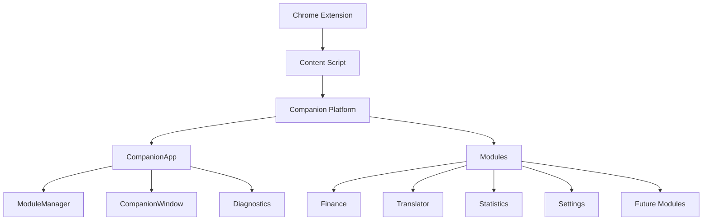

# Companion

A modular productivity platform for GoldenBride CRM.

## What is Companion?

Companion is a modular productivity platform for GoldenBride CRM. It provides floating UI widgets for finance data, translation, statistics, and other operational tools. Currently deployed as a Tampermonkey userscript, with a Chrome Extension (Manifest V3) as the production target.

## Mission

Companion transforms the GoldenBride CRM workflow from manual, repetitive tasks into an intelligent, automated experience. Every second saved compounds into meaningful productivity gains.

## Features

- **Finance** — Real-time transaction data with smart shift filtering (Morning/Day/Night)
- **Translator** — On-demand translation (planned)
- **Statistics** — Data insights and analytics (planned)
- **Modular** — Easy to add new features as independent modules
- **Persistent** — Window positions, sizes, and states persist across sessions

## Architecture



### Core Components

| Component | Responsibility |
|-----------|----------------|
| CompanionApp | Singleton launcher, menu UI, delegates to ModuleManager |
| ModuleManager | Module registration and lifecycle management |
| CompanionWindow | Base class for draggable, resizable, collapsible windows |
| Diagnostics | Development mode logging |

### Current Modules

| Module | Status |
|--------|--------|
| Finance | Active |
| Translator | Planned |
| Statistics | Planned |

## Documentation

| Document | Description |
|----------|-------------|
| [Vision](docs/vision.md) | Why Companion exists — mission, goals, philosophy |
| [Architecture](docs/architecture.md) | System design, layers, dependency rules |
| [Module API](docs/module-api.md) | Module lifecycle, interface, registration |
| [UI Guidelines](docs/ui-guidelines.md) | Visual standards, spacing, colors |
| [Coding Standards](docs/coding-standards.md) | Naming, typing, formatting, architecture rules |
| [Project Structure](docs/project-structure.md) | Directory layout and purpose |
| [Branding](docs/branding.md) | Logo, colors, brand consistency |
| [Security](docs/security.md) | Threat model, protection, limitations |
| [Build](docs/build.md) | Build pipeline — legacy, current, future |
| [Roadmap](docs/roadmap.md) | Version plan, feature timeline |
| [Decision Log](docs/decision-log.md) | Architecture Decision Records |
| [AI Rules](docs/ai-rules.md) | Mandatory rules for AI assistants |

## Getting Started

### Prerequisites

- Node.js 18+
- TypeScript 5+
- esbuild

### Build

```bash
node agencybooster-devtoolkit/build-finance.mjs
```

### Install (Tampermonkey — Development)

1. Install Tampermonkey browser extension
2. Create new userscript
3. Copy contents of `scripts/Companion.user.js`
4. Navigate to GoldenBride CRM

### Development Mode

Enable diagnostic logging:

```javascript
localStorage.setItem("ab-dev", "1");
```

## Development

### Coding Standards

See [Coding Standards](docs/coding-standards.md) for complete guidelines.

**Quick Reference:**
- **Classes:** PascalCase (`CompanionApp`, `ModuleManager`)
- **Methods:** camelCase (`registerModule`, `getModules`)
- **Constants:** SCREAMING_SNAKE_CASE (`DEFAULT_STATE`, `STORAGE_KEY`)
- **Files:** kebab-case (`companion-app.ts`, `finance-widget.ts`)
- **CSS:** kebab-case (`ab-finance-header`, `ab-companion-launcher`)

### Architecture Rules

See [Architecture](docs/architecture.md) and [AI Rules](docs/ai-rules.md).

**Key Rules:**
- CompanionApp never imports specific modules
- Modules never import other modules
- Business logic never exists in UI classes
- Every feature starts with documentation

## Roadmap

| Version | Theme | Features |
|---------|-------|----------|
| 1.0 | Platform Transition | Chrome Extension, Finance, Settings |
| 1.1 | Language Support | Translator |
| 1.2 | Data Insights | Statistics |
| 1.3 | Automation | Rules |
| 1.4 | Intelligence | AI Assistant |
| 2.0 | Ecosystem | Module SDK, Plugin System |

See [Roadmap](docs/roadmap.md) for detailed timeline.

## License

All Rights Reserved. See [LICENSE](LICENSE).

## Copyright

See [NOTICE](NOTICE).
