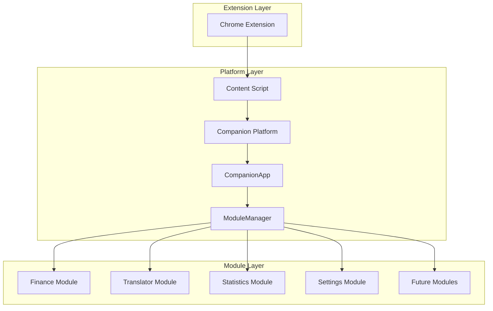
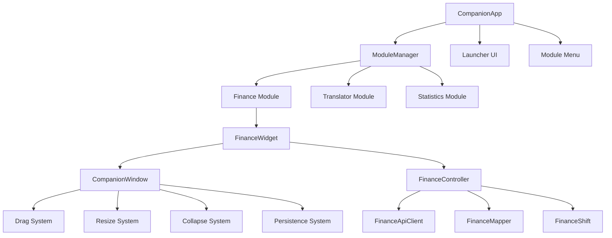
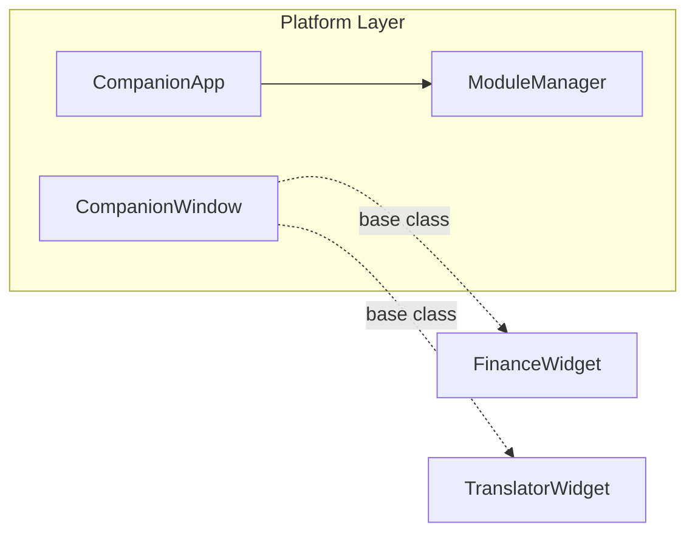
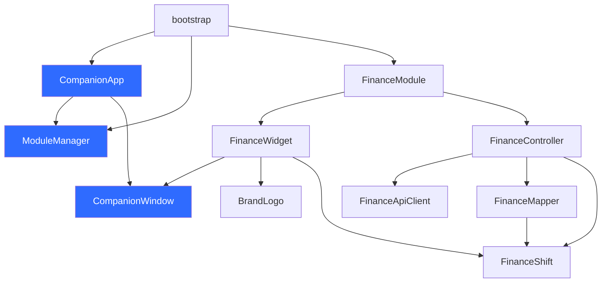

# Architecture

## Overview

Companion is a modular productivity platform built as a browser extension. It injects into GoldenBride CRM pages and provides floating UI widgets for finance data, translation, statistics, and other operational tools.

The architecture follows a strict layered design where each layer has defined responsibilities and communication boundaries.

## System Architecture

## Component Hierarchy

## Layers

### Extension Layer

The Chrome Extension provides the runtime environment. It manages permissions, content script injection, and background processing. In the current Tampermonkey phase, this layer is handled by the userscript runtime.

**Responsibilities:**
- Extension lifecycle management
- Content script injection into target pages
- Permission management
- Background task processing (future)

### Content Script Layer

The content script runs in the context of GoldenBride CRM pages. It has direct access to the DOM and can communicate with the extension background through message passing.

**Responsibilities:**
- DOM access
- Page event handling
- Extension message passing

### Platform Layer

The Companion Platform is the core application. It initializes the module system, manages the launcher UI, and coordinates module lifecycle.

#### CompanionApp

CompanionApp is the application entry point and singleton launcher.

**Responsibilities:**
- Application initialization
- Launcher button creation
- Module menu rendering
- Delegating module operations to ModuleManager
- Style injection

**Forbidden:**
- Direct knowledge of specific modules (Finance, Translator, etc.)
- Widget creation or management
- Business logic

#### ModuleManager

ModuleManager owns the complete module lifecycle. It is the only component that can register, find, open, close, or destroy modules.

**Responsibilities:**
- Module registration
- Module lookup by name
- Opening and closing modules
- Exposing the module list
- Lifecycle coordination

**Forbidden:**
- Direct DOM manipulation
- UI rendering
- Knowledge of module internals

#### CompanionWindow

CompanionWindow is the abstract base class for all draggable, resizable, collapsible windows.

**Responsibilities:**
- Drag handling
- Resize handling
- Collapse/expand behavior
- State persistence (position, size, collapsed, hidden)
- Keyboard shortcuts (ESC to close)
- Show/hide behavior

**Design:**
- Subclasses call `initWindow(dragHandle, resizeHandle)` after creating their DOM
- State is persisted to localStorage with configurable storage keys
- Two independent layouts: expanded and collapsed
- Collapsed layout uses fixed constants (330x44px)

### Module Layer

Modules are independent features that register with the ModuleManager. Each module implements the `CompanionModule` interface and manages its own lifecycle.

**Responsibilities:**
- Implementing the `CompanionModule` interface
- Managing internal state
- Creating and destroying its own DOM
- Handling its own business logic
- Responding to open/close lifecycle events

**Forbidden:**
- Direct knowledge of other modules
- Importing other modules' internal types
- Accessing other modules' DOM elements
- Registering with CompanionApp directly (must use ModuleManager)

### Shared Layer

Shared code provides common utilities, types, and constants used across modules.

**Components:**
- `dev.ts` — Development mode diagnostics
- `brand-logo.ts` — Official SVG logo
- `brand-colors.ts` — Brand color constants

### Assets

Static resources including logos, icons, and images. The single source of truth for branding assets.

## Dependencies

## Allowed Communication

| From | To | Mechanism |
|------|-----|-----------|
| CompanionApp | ModuleManager | Direct method calls |
| ModuleManager | Modules | Interface method calls |
| Modules | CompanionWindow | Inheritance |
| Bootstrap | CompanionApp | Construction |
| Bootstrap | ModuleManager | Registration |
| Modules | Shared utilities | Import |

## Forbidden Dependencies

| From | To | Reason |
|------|-----|--------|
| CompanionApp | Specific modules | Violates module independence |
| Modules | Other modules | Creates coupling |
| CompanionWindow | Specific modules | Base class must remain generic |
| Modules | CompanionApp internals | Violates encapsulation |
| Any layer | DOM outside own scope | Prevents side effects |

## Architectural Rules

1. **CompanionApp never knows about Finance, Translator, or any specific module.** It works exclusively through the `CompanionModule` interface.

2. **ModuleManager is the only component that manages module lifecycle.** No other component may register, open, close, or destroy modules.

3. **CompanionWindow is the only base class for windows.** All draggable, resizable, collapsible UI must extend CompanionWindow.

4. **Modules are lazy-initialized.** A module's internal resources (controllers, widgets, API clients) are created only on first open and never recreated.

5. **State persistence is managed by CompanionWindow.** Modules do not implement their own persistence for window state.

6. **No circular dependencies.** Dependencies flow in one direction: bootstrap -> platform -> modules -> shared.

7. **Documentation is the source of truth.** If code conflicts with documentation, documentation is updated only after explicit approval.
