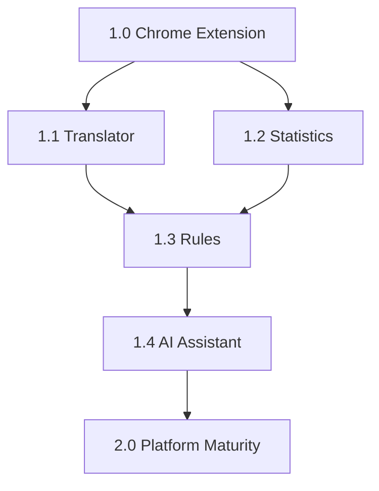

# Roadmap

## Overview

Companion evolves through versioned releases. Each version delivers complete, tested functionality. No version ships incomplete features.

## Version History

### Pre-release (Current)

- Tampermonkey userscript delivery
- Finance module (complete)
- CompanionWindow base class
- ModuleManager lifecycle
- Documentation foundation

## Version Plan

### Version 1.0 — Chrome Extension

**Theme:** Platform Transition

| Feature | Status | Description |
|---------|--------|-------------|
| Chrome Extension | Planned | Manifest V3 wrapper |
| Finance | Complete | Live finance data with shift filtering |
| Settings | Planned | Module preferences and configuration |
| Background Script | Planned | Service worker for persistent state |
| Permissions | Planned | Minimal permission model |

**Milestones:**
1. Extension scaffolding (manifest, icons, build pipeline)
2. Content script injection
3. Settings module
4. Finance migration to extension context
5. Chrome Web Store preparation

### Version 1.1 — Translator

**Theme:** Language Support

| Feature | Status | Description |
|---------|--------|-------------|
| Translator Module | Planned | Real-time message translation |
| Language Detection | Planned | Automatic source language identification |
| Translation History | Planned | Recent translations cache |
| Quick Phrases | Planned | Saved phrase library |

**Milestones:**
1. Translator module scaffolding
2. Translation API integration
3. Widget UI implementation
4. Quick phrases feature
5. History and caching

### Version 1.2 — Statistics

**Theme:** Data Insights

| Feature | Status | Description |
|---------|--------|-------------|
| Statistics Module | Planned | Operational analytics |
| Activity Dashboard | Planned | Daily/weekly/monthly metrics |
| Performance Charts | Planned | Visual trend analysis |
| Export | Planned | Data export to CSV |

**Milestones:**
1. Statistics module scaffolding
2. Data collection pipeline
3. Dashboard UI
4. Chart rendering
5. Export functionality

### Version 1.3 — Rules

**Theme:** Automation

| Feature | Status | Description |
|---------|--------|-------------|
| Rules Module | Planned | Workflow automation |
| Trigger System | Planned | Event-based rule execution |
| Action Library | Planned | Predefined action templates |
| Rule Editor | Planned | Visual rule builder |

**Milestones:**
1. Rules module scaffolding
2. Trigger system implementation
3. Action library
4. Rule editor UI
5. Testing framework

### Version 1.4 — AI Assistant

**Theme:** Intelligence

| Feature | Status | Description |
|---------|--------|-------------|
| AI Module | Planned | Intelligent assistance |
| Context Awareness | Planned | CRM state understanding |
| Suggestion Engine | Planned | Proactive recommendations |
| Natural Language | Planned | Conversational interface |

**Milestones:**
1. AI module scaffolding
2. Context collection pipeline
3. Suggestion engine
4. Natural language interface
5. Integration testing

### Version 2.0 — Platform Maturity

**Theme:** Ecosystem

| Feature | Status | Description |
|---------|--------|-------------|
| Module SDK | Planned | Third-party module development |
| Plugin System | Planned | Community extensions |
| API Layer | Planned | Programmatic access |
| Documentation Site | Planned | Interactive documentation |

**Milestones:**
1. SDK design and implementation
2. Plugin sandbox
3. API gateway
4. Documentation site
5. Community guidelines

## Release Criteria

Each version must meet:

1. All features complete and tested
2. Documentation updated
3. Bundle size within budget
4. Zero production incidents from previous version
5. All acceptance criteria met

## Dependencies

## Risk Factors

| Risk | Mitigation |
|------|------------|
| Chrome Extension review delays | Submit early, address feedback quickly |
| API changes in GoldenBride CRM | Abstract API layer, version endpoints |
| Feature scope creep | Strict adherence to version scope |
| Performance degradation | Bundle size budget, profiling |
