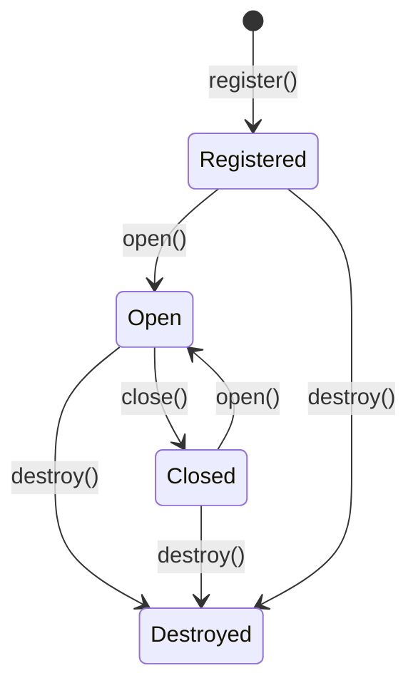

# Module API

## Overview

Every Companion module implements the `CompanionModule` interface. This interface defines the lifecycle contract that ModuleManager uses to manage modules.

## Lifecycle



### Lifecycle States

| State | Description |
|-------|-------------|
| Registered | Module is registered with ModuleManager but not yet instantiated internally |
| Open | Module's widget is visible and active |
| Closed | Module's widget is hidden but resources persist |
| Destroyed | Module's resources are cleaned up and removed |

## Current Interface

```typescript
interface CompanionModule {
    /** Unique module identifier. Used for registration and lookup. */
    readonly name: string;

    /** Human-readable label shown in the launcher menu. */
    readonly label: string;

    /** Open/show the module. Creates internal resources on first call. */
    open(): void;

    /** Close/hide the module. Resources persist for quick reopen. */
    close(): void;

    /** Whether the module is currently open. */
    readonly isOpen: boolean;

    /** Destroy the module and release all resources. */
    destroy(): void;
}
```

## Future Interface

The interface will be extended to support richer module metadata and async initialization:

```typescript
interface CompanionModule {
    /** Unique module identifier. Used for registration and lookup. */
    readonly name: string;

    /** Human-readable label shown in the launcher menu. */
    readonly label: string;

    /** Semantic version string (e.g., "1.0.0"). */
    readonly version: string;

    /** Optional icon for the launcher menu. Raw SVG string or data URI. */
    readonly icon?: string;

    /** Optional async initialization. Called before first open(). */
    initialize?(): Promise<void>;

    /** Open/show the module. Creates internal resources on first call. */
    open(): void;

    /** Close/hide the module. Resources persist for quick reopen. */
    close(): void;

    /** Whether the module is currently open. */
    readonly isOpen: boolean;

    /** Destroy the module and release all resources. */
    destroy(): void;
}
```

### New Properties

| Property | Type | Required | Description |
|----------|------|----------|-------------|
| `version` | `string` | Yes | Semantic version for module identification |
| `icon` | `string` | No | SVG or data URI for launcher menu icon |
| `initialize()` | `() => Promise<void>` | No | Async setup before first open |

### initialize() Pattern

The optional `initialize()` method enables lazy and async module setup:

```typescript
function createTranslatorModule(): CompanionModule {
    let widget: TranslatorWidget | null = null;
    let initialized = false;
    let ready = false;

    return {
        name: "translator",
        label: "Translator",
        version: "1.0.0",
        icon: COMPANION_LOGO_SVG,

        async initialize(): Promise<void> {
            if (ready) return;
            // Load dictionaries, prepare API clients, etc.
            await loadDictionaries();
            ready = true;
        },

        open(): void {
            if (!initialized) {
                initialized = true;
                widget = new TranslatorWidget();
                widget.hide();
            }
            widget?.show();
        },

        close(): void {
            widget?.hide();
        },

        get isOpen(): boolean {
            return widget?.isVisible ?? false;
        },

        destroy(): void {
            widget?.destroy();
            widget = null;
            initialized = false;
            ready = false;
        },
    };
}
```

ModuleManager will call `initialize()` before the first `open()` if it exists. This enables:
- Loading external resources (dictionaries, configurations)
- Async API client setup
- Lazy dependency loading

## Module Registration

Modules are registered with the ModuleManager during bootstrap. Registration makes a module available in the launcher menu but does not create any internal resources.

```typescript
// In bootstrap.ts
const manager = new ModuleManager();
manager.register(createFinanceModule());
```

### Registration Rules

1. Each module must have a unique `name` string
2. Duplicate registrations are silently ignored
3. Registration happens once during bootstrap
4. Modules are registered before the application starts

## Lazy Initialization

Modules follow lazy initialization patterns:

1. **Registration** — the module factory function is called during bootstrap, creating the module descriptor object
2. **First open** — internal resources (controllers, widgets, API clients) are created on the first `open()` call
3. **Subsequent opens** — the existing widget is shown without recreation

```typescript
function createFinanceModule(): CompanionModule {
    let widget: FinanceWidget | null = null;
    let controller: FinanceController | null = null;
    let initialized = false;

    return {
        name: "finance",
        label: "Finance",
        version: "1.0.0",
        open(): void {
            if (!initialized) {
                initialized = true;
                controller = new FinanceController();
                widget = new FinanceWidget(controller);
                widget.hide();
            }
            widget?.show();
        },
        close(): void {
            widget?.hide();
        },
        get isOpen(): boolean {
            return widget?.isVisible ?? false;
        },
        destroy(): void {
            widget?.destroy();
            controller?.cancelPending();
            widget = null;
            controller = null;
            initialized = false;
        },
    };
}
```

## Responsibilities

### Module Responsibilities

- Implement the `CompanionModule` interface
- Manage internal state and resources
- Create and destroy its own DOM elements
- Handle its own business logic
- Respond to open/close lifecycle events
- Clean up resources in `destroy()`

### ModuleManager Responsibilities

- Register modules during bootstrap
- Find modules by name
- Open and close modules
- Expose the module list to CompanionApp
- Coordinate lifecycle events
- Call `initialize()` before first `open()` (future)

### CompanionApp Responsibilities

- Create the launcher UI
- Render the module menu
- Delegate module operations to ModuleManager
- Never know about specific module internals

## Future Compatibility

### Adding a New Module

1. Create the module file in `src/companion/`
2. Implement the `CompanionModule` interface
3. Register the module in `bootstrap.ts`
4. Follow naming conventions (`companion-module-name.ts`)
5. Export public types from `index.ts`

### Module Independence Rules

- No module imports another module's types
- No module accesses another module's DOM
- No module depends on another module's state
- All inter-module communication goes through ModuleManager

### Backward Compatibility

- The `CompanionModule` interface may only be extended, never reduced
- New optional properties may be added
- Existing properties must maintain their signatures
- Lifecycle semantics must remain consistent
