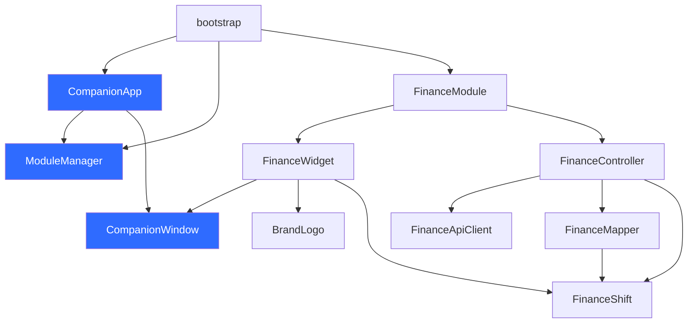

# Project Structure

## Overview

Companion follows a layered directory structure that separates concerns and enforces dependency boundaries.

## Directory Layout

```
Companion/
├── src/
│   └── companion/
│       ├── bootstrap.ts              Application entry point
│       ├── companion-app.ts          Launcher and UI
│       ├── companion-module.ts       Module interface
│       ├── companion-window.ts       Base window class
│       ├── module-manager.ts         Module lifecycle
│       ├── dev.ts                    Development diagnostics
│       ├── brand-logo.ts            Official SVG logo
│       ├── brand-colors.ts          Brand color constants
│       ├── finance-api-client.ts    HTTP communication
│       ├── finance-controller.ts    Orchestration
│       ├── finance-mapper.ts        Response mapping
│       ├── finance-shift.ts         Shift definitions
│       ├── finance-widget.ts        Widget UI
│       ├── finance-widget.css.ts    Widget styles
│       └── index.ts                 Barrel exports
├── agencybooster-devtoolkit/
│   ├── build-finance.mjs            Build script
│   ├── package.json                 Dependencies
│   └── tsconfig.json               TypeScript config
├── scripts/
│   └── Companion.user.js            Built bundle
├── assets/                          Static resources
├── docs/                            Documentation
├── LICENSE                          License file
├── NOTICE                           Copyright notice
└── README.md                        Project overview
```

## Purpose of Each Directory

### src/companion/

The core source directory containing all Companion platform code.

| File | Purpose |
|------|---------|
| `bootstrap.ts` | Entry point. Creates CompanionApp, registers modules, starts the application. |
| `companion-app.ts` | Singleton launcher. Creates UI, manages menu, delegates to ModuleManager. |
| `companion-module.ts` | TypeScript interface for all modules. |
| `companion-window.ts` | Abstract base class for draggable, resizable windows. |
| `module-manager.ts` | Module registration and lifecycle management. |
| `dev.ts` | Development mode detection and diagnostic logging. |
| `brand-logo.ts` | Official SVG logo as a string constant. |
| `brand-colors.ts` | Brand color constants. |
| `finance-api-client.ts` | HTTP client for Finance API endpoints. |
| `finance-controller.ts` | State management for Finance module. |
| `finance-mapper.ts` | Response validation and transformation. |
| `finance-shift.ts` | Shift time definitions and filtering logic. |
| `finance-widget.ts` | Finance widget UI (extends CompanionWindow). |
| `finance-widget.css.ts` | Finance widget CSS as a string constant. |
| `index.ts` | Barrel exports for all public types and classes. |

### agencybooster-devtoolkit/

Build tooling and configuration.

| File | Purpose |
|------|---------|
| `build-finance.mjs` | esbuild configuration for bundling. |
| `package.json` | Node.js dependencies (esbuild, TypeScript). |
| `tsconfig.json` | TypeScript compiler configuration. |

### scripts/

Built output directory.

| File | Purpose |
|------|---------|
| `Companion.user.js` | Final bundled userscript ready for installation. |

### assets/

Static resources (currently empty). Future use for icons, images, and other binary assets.

### docs/

Project documentation. See [Documentation Index](#documentation-index) for complete listing.

## Documentation Index

| Document | Purpose |
|----------|---------|
| [Vision](vision.md) | Why Companion exists. Mission, goals, philosophy. |
| [Architecture](architecture.md) | System design, component hierarchy, dependency rules. |
| [Module API](module-api.md) | Module lifecycle, interface, registration patterns. |
| [UI Guidelines](ui-guidelines.md) | Visual standards, spacing, colors, behaviors. |
| [Coding Standards](coding-standards.md) | Naming, typing, formatting, forbidden practices. |
| [Project Structure](project-structure.md) | This document. Directory layout and purpose. |
| [Branding](branding.md) | Logo usage, icon generation, brand consistency. |
| [Security](security.md) | Threat model, protection strategy, limitations. |
| [Build](build.md) | Build pipeline, current and future. |
| [Roadmap](roadmap.md) | Version plan, feature timeline. |
| [Decision Log](decision-log.md) | Architecture Decision Records. |
| [AI Rules](ai-rules.md) | Mandatory rules for AI assistants. |

## File Naming Rules

- All source files: `kebab-case.ts`
- CSS-in-JS files: `kebab-case.css.ts`
- Documentation: `kebab-case.md`
- Build scripts: `kebab-case.mjs`

## Import Graph


